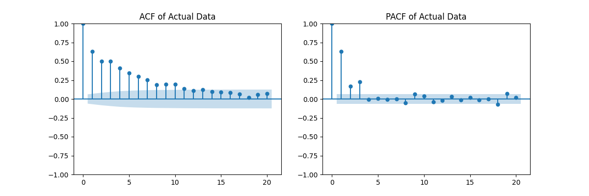
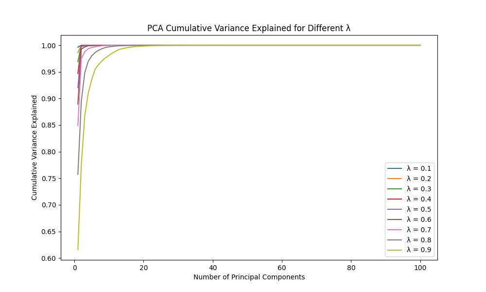

# Project 1

**Christian Hollar**  
*christian.hollar@duke.edu*

## Problem 1

### Part A
For Part A, the following statistics were calculated:
- Mean: 0.050198
- Variance: 0.010322
- Skewness: 0.120626
- Kurtosis: 0.230070

### Part B
Part B compared a Normal Distribution with a T-Distribution. The observed kurtosis was higher than 0, suggesting heavier tails than a normal. Based on this, the T-Distribution would be preferable. 

### Part C
Both distributions were fitted using MLE. The more negative AIC and BIC values for the Normal Distribution indicated a better fit, relative to the initial kurtosis result. Therefore, a Normal Distribution was chosen as the better fit.

## Problem 2

### Part A: Pairwise Covariance Matrix
A pairwise approach was used to compute covariances between columns, ignoring rows lacking data for each pair. The matrix obtained was:

||||||
|-------------|-------------|-------------|-------------|-------------|
| 1.47048437  | 1.45421424  | 0.87726904  | 1.90322645  | 1.44436105  |
| 1.45421424  | 1.25207795  | 0.53954816  | 1.62191837  | 1.23787697  |
| 0.87726904  | 0.53954816  | 1.272425    | 1.17195897  | 1.091912    |
| 1.90322645  | 1.62191837  | 1.17195897  | 1.81446921  | 1.58972858  |
| 1.44436105  | 1.23787697  | 1.091912    | 1.58972858  | 1.39618646  |

### Part B: Positive Semi-Definiteness Check
The eigenvalues were:

| Eigenvalue   |
|-------------:|
|  6.78670573  |
|  0.83443367  |
| -0.31024286  |
|  0.02797828  |
| -0.13323183  |

Two negative eigenvalues were found, indicating the matrix is not positive semi-definite.

### Part C: Nearest PSD Matrix
Two methods were used: Rebenato and Jackel, and Higham’s method.

#### Rebenato and Jackel
This approach sets all negative eigenvalues to zero after eigen-decomposition and reconstructs the matrix:

||||||
|-------------|-------------|-------------|-------------|-------------|
| 1.61513295  | 1.44196041  | 0.89714421  | 1.78042572  | 1.43379434  |
| 1.44196041  | 1.34696791  | 0.58508635  | 1.55455193  | 1.21140918  |
| 0.89714421  | 0.58508635  | 1.29891578  | 1.11595578  | 1.07669234  |
| 1.78042572  | 1.55455193  | 1.11595578  | 1.98316488  | 1.62137332  |
| 1.43379434  | 1.21140918  | 1.07669234  | 1.62137332  | 1.40493616  |

#### Higham’s Method
1. With matrix A, set Y₀ = A**, ΔS₀ = 0.
2. Rₖ = Yₖ₋₁ - ΔSₖ₋₁.
3. Clamp negative eigenvalues of Rₖ to zero.
4. Update ΔS.
5. Repeat until the difference ||Yₖ - Yₖ₋₁|| is below a tolerance or the maximum number of iterations is reached.

||||||
|-------------|-------------|-------------|-------------|-------------|
| 1.61513295  | 1.44196041  | 0.89714421  | 1.78042572  | 1.43379434  |
| 1.44196041  | 1.34696791  | 0.58508635  | 1.55455193  | 1.21140918  |
| 0.89714421  | 0.58508635  | 1.29891578  | 1.11595578  | 1.07669234  |
| 1.78042572  | 1.55455193  | 1.11595578  | 1.98316488  | 1.62137332  |
| 1.43379434  | 1.21140918  | 1.07669234  | 1.62137332  | 1.40493616  |

### Part D: Overlapping Data Covariance
Excluding rows with missing data for any column produced the following covariance matrix (using same cov matrix methodology from part A):

||||||
|------------|------------|------------|------------|------------|
| 0.41860366 | 0.39405407 | 0.42445735 | 0.41638241 | 0.43428682 |
| 0.39405407 | 0.39678563 | 0.40934344 | 0.3984012  | 0.42263077 |
| 0.42445735 | 0.40934344 | 0.4413601  | 0.42844141 | 0.44895733 |
| 0.41638241 | 0.3984012  | 0.42844141 | 0.43727358 | 0.44016735 |
| 0.43428682 | 0.42263077 | 0.44895733 | 0.44016735 | 0.46627249 |


### Part E: Comparison of the Matrices from (C) and (D)
The matrices in (C) use maximum available pairs, which can create inconsistencies leading to negative eigenvalues. The overlapping-data matrix in (D) is PSD by construction but may discard many rows. The off-diagonal values in the near-PSD matrices can differ significantly from the overlapping-data approach because of sample size differences.

## Problem 3

### Part A: Fitting a Multivariate Normal
After loading the dataset, the sample mean vector and covariance matrix were computed for X_1 and X_2. The mean is approximately [0.0460, 0.0999], and the covariance matrix is:

|||
|------------|------------|
| 0.0101622  | 0.00492354 |
| 0.00492354 | 0.02028441 |

### Part B: Distribution of X_2 Given X_1 = 0.6

**Method 1 (Conditional Formula)**
Using the standard bivariate normal conditional formula gave:
- Conditional Mean ~ 0.368325
- Conditional Variance ~ 0.017899

**Method 2 (Linear Regression)**
A simple linear regression of X_2 on X_1 yielded:
- Conditional Mean ~ 0.368325
- Residual MSE ~ 0.017917

Both methods align well.

### Part C: Cholesky-Based Simulation
A large sample (X_1, X_2) was generated from N(μ, Σ). After filtering for X_1 close to 0.6:
- Simulated Conditional Mean ~ 0.368784
- Simulated Conditional Variance ~ 0.014673

These are consistent with the analytical approach.

## Problem 4

### Part A: Simulating MA(1), MA(2), and MA(3)

1. **MA(1)**

.png)

   - **ACF**: Notice a significant spike at lag 1, then it drops near zero for higher lags.  
   - **PACF**: The first two lags are significant. Lag 17 is also significant.

2. **MA(2)**  

.png)

   - **ACF**: Typically shows two significant spikes (lags 1 and 2) before going near zero for larger lags.  
   - **PACF**: Although MA(1) doesn't exhibit gradual tapering, MA(2) PCF shows an even more aggressive drop after the first lag.

3. **MA(3)**

.png)

   - **ACF**: Three significant autocorrelation spikes (lags 1, 2, and 3), dropping off afterward.  
   - **PACF**: Similar to MA(2) PCF, gradual tapering isn't seen. 

### Part B: Simulating AR(1), AR(2), and AR(3)

1. **AR(1)** 

.png)

   - **ACF**: It tails off exponentially, but it cuts off after lag 2.  
   - **PACF**: Shows a clear significant spike at lag 1, then becomes very small afterward.

2. **AR(2)**  

.png)

   - **ACF**: It decays as expected for an AR model.  
   - **PACF**: Significant spikes at lags 1 and 2, then mostly zero for higher lags.

3. **AR(3)** 

.png)

   - **ACF**: It decays, but it decays at an even slower rate than seen in AR(20).  
   - **PACF**: Three significant partial autocorrelation spikes, followed by lower values afterward. This confirms AR(3) structure. 

### Part C: Examining `problem4.csv`

The ACF gradually declines, and the PACF has three prominent lags. This suggests an AR(3) model.

### Part D
Model fit comparison using AIC and AICc:

```
(1, 0, 0) => (AIC=-1669.089, AICc=-1669.065)
(2, 0, 0) => (AIC=-1696.092, AICc=-1696.051)
(3, 0, 0) => (AIC=-1746.282, AICc=-1746.221)
(0, 0, 1) => (AIC=-1508.927, AICc=-1508.903)
(0, 0, 2) => (AIC=-1559.251, AICc=-1559.211)
(0, 0, 3) => (AIC=-1645.133, AICc=-1645.073)
```

The best model by AIC is AR(3).

## Problem 5

### Part B


### Part C
Larger lambda values decay more slowly, so older observations remain significant and the covariance matrix is more stable. Smaller lambda values make recent data more influential, producing a sharper drop in the leading principal components.

## Problem 6

### Part A
A Cholesky Root simulation was performed with a near-psd matrix for stability. The matrix was generated using the near-psd method of Rebenato and Jackel.

### Part C
The Frobenius norm relative to the original is 0.000006 for Cholesky-based and 0.000022 for PCA-based, indicating the Cholesky-based matrix is closer.

### Part D
The Cholesky-based matrix preserves the entire covariance structure, leading to a gradual cumulative variance. The PCA-based method explains 66% by the first component, 84% by the seventh, and 100% by the 29th, reflecting fewer non-zero eigenvalues and a lower rank.

### Part F: Tradeoffs
The Cholesky approach is quicker and retains the full covariance. PCA offers dimension reduction and noise filtering, which can be beneficial in high-dimensional settings or when dropping minor components is preferred.
