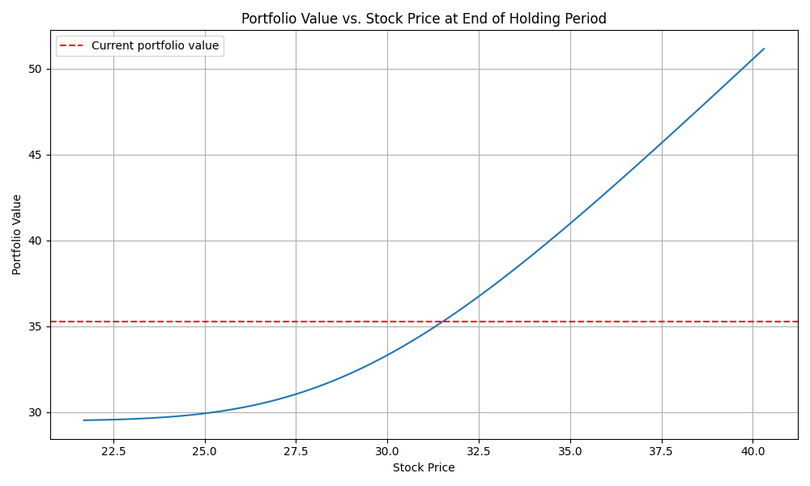

# Project 2
**Christian Hollar**

## Problem 1

### Part A
In Part A, I was asked to calculate the arithmetic return of each stock within the provided DataFrame. I calculated this by using the following formula:

```
P(t) / P(t-1) - 1
```

I then calculated the mean return and subtracted it for each column in the DataFrame containing the log returns.

The last five rows of the DataFrame are:
| Index | SPY | AAPL | NVDA | MSFT | AMZN | META | GOOGL | AVGO | TSLA | GOOG | BRK-B | JPM | LLY | V | XOM | UNH | MA | COST | PG | WMT |
|-------|-----|------|------|------|------|------|-------|------|------|------|-------|-----|-----|---|-----|-----|----|------|----|-----|
| 499 | -0.011515 | -0.014675 | -0.025686 | -0.018613 | -0.016550 | -0.009030 | -0.016157 | -0.017748 | -0.053398 | -0.017179 | -0.006371 | -0.009410 | -0.015454 | -0.007893 | -0.000236 | -0.002311 | -0.008229 | -0.018815 | -0.003978 | -0.013579 |
| 500 | -0.012410 | -0.014696 | -0.001100 | -0.014488 | -0.012919 | -0.017536 | -0.009448 | -0.028779 | -0.036222 | -0.008513 | -0.010332 | -0.008975 | -0.013529 | -0.011426 | -0.006927 | -0.004342 | -0.013408 | -0.020259 | -0.014766 | -0.013289 |
| 501 | -0.004577 | -0.008427 | -0.028147 | -0.009029 | -0.010577 | -0.012884 | -0.011727 | -0.018928 | -0.035703 | -0.013277 | 0.001717 | 0.000354 | -0.003925 | 0.001455 | 0.016827 | -0.003867 | 0.001105 | -0.007933 | 0.003077 | -0.003758 |
| 502 | -0.003392 | -0.027930 | 0.024899 | -0.008112 | 0.001867 | 0.020033 | -0.000844 | -0.002321 | -0.065396 | -0.000535 | -0.005578 | -0.000065 | 0.006288 | -0.006060 | -0.002562 | -0.002711 | -0.008785 | -0.008546 | -0.010280 | -0.005208 |
| 503 | 0.011494 | -0.003356 | 0.038977 | 0.010171 | 0.015958 | 0.005809 | 0.010851 | -0.000471 | 0.076303 | 0.011497 | 0.004681 | 0.012300 | 0.003469 | 0.000763 | 0.004970 | 0.016649 | -0.002827 | 0.005942 | -0.005403 | 0.007303 |  

<br>

| Index | HD | NFLX | JNJ | ABBV | CRM | BAC | ORCL | MRK | CVX | KO | CSCO | WFC | ACN | NOW | MCD | PEP | IBM | DIS | TMO | LIN |
|-------|----|------|-----|------|-----|-----|------|-----|-----|----|------|-----|-----|-----|-----|-----|-----|-----|-----|-----|
| 499 | -0.013579 | -0.006294 | -0.020291 | -0.003332 | -0.007031 | -0.011424 | -0.005414 | -0.017389 | -0.001585 | 0.000322 | -0.001988 | -0.006733 | -0.010275 | -0.012460 | -0.018225 | -0.004308 | 0.003189 | -0.010479 | -0.009392 | -0.002041 |
| 500 | -0.013289 | -0.009276 | -0.010052 | -0.011544 | -0.010588 | -0.009848 | -0.010434 | -0.013626 | -0.013311 | -0.006296 | -0.006816 | -0.007616 | -0.011068 | -0.011013 | -0.014842 | -0.014083 | -0.007440 | -0.012473 | -0.007213 | -0.013772 |
| 501 | -0.003758 | -0.001637 | -0.012344 | 0.009206 | 0.008109 | -0.006017 | 0.000222 | -0.003038 | 0.011339 | 0.012479 | 0.003633 | -0.000376 | -0.003593 | -0.002587 | -0.009161 | 0.000704 | 0.002480 | -0.002961 | 0.004484 | 0.002742 |
| 502 | -0.005208 | -0.001870 | -0.007339 | -0.003842 | 0.009376 | -0.012847 | 0.007018 | -0.005086 | -0.003002 | 0.013012 | -0.006837 | -0.002236 | -0.001888 | -0.009077 | -0.007504 | 0.008700 | -0.011999 | -0.000552 | -0.005238 | 0.004555 |
| 503 | 0.007303 | 0.001345 | -0.008602 | 0.001495 | 0.009503 | 0.004943 | 0.010984 | 0.000326 | -0.000184 | 0.007924 | -0.001525 | 0.002177 | 0.014655 | 0.013718 | 0.016224 | 0.007433 | -0.003494 | 0.011194 | 0.002596 | 0.017989 |  

<br>

| Index | ABT | AMD | ADBE | PM | ISRG | GE | GS | INTU | CAT | QCOM | TXN | VZ | AXP | T | BKNG | SPGI | MS | RTX | PLTR | PFE |
|-------|-----|-----|------|----|------|----|----|------|-----|------|-----|----|-----|---|------|------|----|-----|------|-----|
| 499 | -0.003734 | -0.002586 | -0.000297 | -0.008696 | -0.002714 | -0.008751 | -0.012830 | -0.009852 | -0.012837 | -0.007083 | -0.009031 | -0.003298 | -0.001278 | -0.011213 | -0.004992 | -0.013344 | -0.006746 | -0.010881 | -0.003187 | -0.042987 |
| 500 | -0.013229 | -0.019383 | -0.023548 | -0.002012 | -0.012503 | -0.016311 | -0.014071 | -0.005701 | -0.014010 | -0.005991 | -0.017922 | -0.017411 | -0.008324 | -0.013928 | -0.011624 | -0.011047 | -0.008386 | -0.008911 | -0.013213 | -0.029341 |
| 501 | 0.001844 | 0.002590 | -0.014904 | -0.003003 | 0.002254 | -0.010927 | -0.010185 | -0.002749 | -0.003834 | -0.001597 | -0.007090 | -0.002822 | 0.009524 | -0.003312 | 0.006424 | -0.006277 | -0.000804 | -0.001150 | 0.003966 | -0.025309 |
| 502 | 0.004555 | -0.011378 | -0.002662 | -0.008798 | 0.005637 | 0.002565 | 0.008373 | 0.002970 | -0.010101 | -0.009185 | -0.017922 | -0.010488 | -0.005918 | 0.002139 | -0.010856 | 0.004110 | -0.008369 | 0.001095 | -0.000913 | -0.001825 |
| 503 | 0.017989 | -0.002190 | 0.037205 | -0.024423 | 0.006993 | 0.019867 | 0.017431 | 0.007808 | 0.010901 | 0.010204 | 0.026046 | 0.018439 | 0.000967 | 0.016315 | -0.007660 | -0.006131 | 0.007356 | 0.008342 | -0.001571 | 0.055611 |  

<br>

| Index | BLK | DHR | NEE | HON | CMCSA | PGR | LOW | AMGN | UNP | TJX | AMAT | UBER | C | BSX | ETN | COP | BA | BX | SYK | PANW |
|-------|-----|-----|-----|-----|-------|-----|-----|------|-----|-----|------|------|---|-----|-----|-----|----|----|-----|------|
| 499 | -0.010446 | 0.000352 | -0.003396 | -0.010373 | -0.008616 | -0.010217 | -0.004899 | -0.002124 | -0.001614 | -0.009491 | -0.005457 | -0.008868 | -0.005952 | -0.010025 | -0.017993 | 0.000406 | 0.002161 | -0.015766 | -0.007077 | -0.014319 |
| 500 | -0.011629 | -0.016991 | -0.006332 | -0.004662 | -0.012946 | -0.014554 | -0.007163 | -0.007024 | -0.012944 | -0.009661 | -0.024158 | -0.020457 | -0.007765 | -0.009664 | -0.012218 | -0.008348 | 0.001849 | -0.023067 | -0.013112 | -0.014104 |
| 501 | 0.001490 | -0.003080 | -0.000473 | -0.000772 | -0.003324 | 0.003522 | -0.001212 | -0.000236 | 0.005047 | 0.000787 | -0.003210 | -0.007342 | -0.009291 | -0.001035 | -0.005371 | 0.021294 | 0.002824 | 0.000363 | -0.004603 | -0.014171 |
| 502 | 0.006868 | 0.004415 | 0.001916 | 0.006445 | 0.044307 | -0.007448 | -0.000678 | -0.001331 | 0.009231 | -0.029133 | 0.005899 | -0.004505 | -0.008663 | -0.011073 | 0.001285 | 0.008675 | -0.005609 | 0.004355 | -0.002172 |
| 503 | 0.010121 | 0.005535 | 0.007347 | 0.010024 | -0.004368 | 0.035927 | 0.020371 | 0.014007 | 0.013201 | 0.029889 | 0.010138 | -0.011250 | 0.010570 | 0.006971 | 0.011856 | 0.006523 | 0.011058 | 0.027388 | -0.005419 | 0.007393 |  

<br>

| Index | ADP | FI | ANET | GILD | BMY | SCHW | TMUS | DE | ADI | VRTX | SBUX | MMC | MDT | CB | LMT | KKR | MU | PLD | LRCX | EQIX |
|-------|-----|-----|-----|-----|-------|-----|-----|------|-----|-----|------|------|---|-----|-----|-----|----|----|-----|------|
| 499 | -0.004095 | -0.012642 | -0.018962 | -0.003570 | -0.005337 | -0.004244 | -0.003951 | -0.008887 | -0.005705 | -0.005426 | 0.004152 | -0.003992 | -0.010797 | -0.002663 | -0.002232 | -0.020024 | -0.014816 | -0.015554 | -0.009780 | -0.006966 |
| 500 | -0.011400 | -0.009594 | -0.017008 | -0.022706 | -0.027906 | -0.010951 | -0.011582 | -0.012777 | -0.021214 | -0.023844 | -0.018197 | -0.007564 | -0.014254 | -0.008718 | -0.011623 | -0.012392 | -0.037776 | -0.001448 | -0.018836 | -0.008064 |
| 501 | -0.001381 | -0.005636 | -0.011284 | 0.003521 | 0.009099 | 0.000968 | -0.000683 | 0.001433 | -0.001268 | 0.007565 | 0.007303 | 0.001445 | 0.003133 | 0.002688 | 0.005146 | -0.005818 | -0.015048 | 0.005591 | -0.000698 | 0.006512 |
| 502 | -0.011084 | 0.001211 | 0.008371 | -0.005697 | 0.004247 | -0.002411 | -0.006437 | -0.013202 | -0.006022 | 0.006775 | 0.009989 | -0.005621 | 0.003998 | -0.014224 | -0.007764 | 0.006071 | 0.036099 | -0.013741 | 0.001101 | 0.000497 |
| 503 | 0.006481 | 0.011059 | 0.027474 | -0.005507 | 0.007302 | 0.008147 | -0.002913 | 0.009487 | 0.018223 | 0.002504 | 0.004355 | -0.000915 | 0.008842 | -0.003442 | -0.001062 | 0.016453 | 0.027517 | 0.013022 | 0.035052 | 0.015745 |

The total standard deviation is ```0.017437217246070138```

### Part B
In Part B, I was asked to calculate the log return of each stock within the provided DataFrame. I calculated this by using the following formula:
```
ln(P(t)) - ln(P(t-1))
```

I then calculated the mean return and subtracted it for each column in the DataFrame containing the log returns.

The last five rows of the DataFrame are:

| Index | SPY | AAPL | NVDA | MSFT | AMZN | META | GOOGL | AVGO | TSLA | GOOG | BRK-B | JPM | LLY | V | XOM | UNH | MA | COST | PG | WMT |
|-------|-----|------|------|------|------|------|-------|------|------|------|-------|-----|-----|---|-----|-----|----|------|----|-----|
| 499 | -0.011515 | -0.014675 | -0.025686 | -0.018613 | -0.016550 | -0.009030 | -0.016157 | -0.017748 | -0.053398 | -0.017179 | -0.006371 | -0.009410 | -0.015454 | -0.007893 | -0.000236 | -0.002311 | -0.008229 | -0.018815 | -0.003978 | -0.013579 |
| 500 | -0.012410 | -0.014696 | -0.001100 | -0.014488 | -0.012919 | -0.017536 | -0.009448 | -0.028779 | -0.036222 | -0.008513 | -0.010332 | -0.008975 | -0.013529 | -0.011426 | -0.006927 | -0.004342 | -0.013408 | -0.020259 | -0.014766 | -0.013289 |
| 501 | -0.004577 | -0.008427 | -0.028147 | -0.009029 | -0.010577 | -0.012884 | -0.011727 | -0.018928 | -0.035703 | -0.013277 | 0.001717 | 0.000354 | -0.003925 | 0.001455 | 0.016827 | -0.003867 | 0.001105 | -0.007933 | 0.003077 | -0.003758 |
| 502 | -0.003392 | -0.027930 | 0.024899 | -0.008112 | 0.001867 | 0.020033 | -0.000844 | -0.002321 | -0.065396 | -0.000535 | -0.005578 | -0.000065 | 0.006288 | -0.006060 | -0.002562 | -0.002711 | -0.008785 | -0.008546 | -0.010280 | -0.005208 |
| 503 | 0.011494 | -0.003356 | 0.038977 | 0.010171 | 0.015958 | 0.005809 | 0.010851 | -0.000471 | 0.076303 | 0.011497 | 0.004681 | 0.012300 | 0.003469 | 0.000763 | 0.004970 | 0.016649 | -0.002827 | 0.005942 | -0.005403 | 0.007303 |  

<br>

| Index | HD | NFLX | JNJ | ABBV | CRM | BAC | ORCL | MRK | CVX | KO | CSCO | WFC | ACN | NOW | MCD | PEP | IBM | DIS | TMO | LIN |
|-------|----|------|-----|------|-----|-----|------|-----|-----|----|------|-----|-----|-----|-----|-----|-----|-----|-----|-----|
| 499 | -0.013579 | -0.006294 | -0.020291 | -0.003332 | -0.007031 | -0.011424 | -0.005414 | -0.017389 | -0.001585 | 0.000322 | -0.001988 | -0.006733 | -0.010275 | -0.012460 | -0.018225 | -0.004308 | 0.003189 | -0.010479 | -0.009392 | -0.002041 |
| 500 | -0.013289 | -0.009276 | -0.010052 | -0.011544 | -0.010588 | -0.009848 | -0.010434 | -0.013626 | -0.013311 | -0.006296 | -0.006816 | -0.007616 | -0.011068 | -0.011013 | -0.014842 | -0.014083 | -0.007440 | -0.012473 | -0.007213 | -0.013772 |
| 501 | -0.003758 | -0.001637 | -0.012344 | 0.009206 | 0.008109 | -0.006017 | 0.000222 | -0.003038 | 0.011339 | 0.012479 | 0.003633 | -0.000376 | -0.003593 | -0.002587 | -0.009161 | 0.000704 | 0.002480 | -0.002961 | 0.004484 | 0.002742 |
| 502 | -0.005208 | -0.001870 | -0.007339 | -0.003842 | 0.009376 | -0.012847 | 0.007018 | -0.005086 | -0.003002 | 0.013012 | -0.006837 | -0.002236 | -0.001888 | -0.009077 | -0.007504 | 0.008700 | -0.011999 | -0.000552 | -0.005238 | 0.004555 |
| 503 | 0.007303 | 0.001345 | -0.008602 | 0.001495 | 0.009503 | 0.004943 | 0.010984 | 0.000326 | -0.000184 | 0.007924 | -0.001525 | 0.002177 | 0.014655 | 0.013718 | 0.016224 | 0.007433 | -0.003494 | 0.011194 | 0.002596 | 0.017989 |  

<br>

| Index | ABT | AMD | ADBE | PM | ISRG | GE | GS | INTU | CAT | QCOM | TXN | VZ | AXP | T | BKNG | SPGI | MS | RTX | PLTR | PFE |
|-------|-----|-----|------|----|------|----|----|------|-----|------|-----|----|-----|---|------|------|----|-----|------|-----|
| 499 | -0.003734 | -0.002586 | -0.000297 | -0.008696 | -0.002714 | -0.008751 | -0.012830 | -0.009852 | -0.012837 | -0.007083 | -0.009031 | -0.003298 | -0.001278 | -0.011213 | -0.004992 | -0.013344 | -0.006746 | -0.010881 | -0.003187 | -0.042987 |
| 500 | -0.013229 | -0.019383 | -0.023548 | -0.002012 | -0.012503 | -0.016311 | -0.014071 | -0.005701 | -0.014010 | -0.005991 | -0.017922 | -0.017411 | -0.008324 | -0.013928 | -0.011624 | -0.011047 | -0.008386 | -0.008911 | -0.013213 | -0.029341 |
| 501 | 0.001844 | 0.002590 | -0.014904 | -0.003003 | 0.002254 | -0.010927 | -0.010185 | -0.002749 | -0.003834 | -0.001597 | -0.007090 | -0.002822 | 0.009524 | -0.003312 | 0.006424 | -0.006277 | -0.000804 | -0.001150 | 0.003966 | -0.025309 |
| 502 | 0.004555 | -0.011378 | -0.002662 | -0.008798 | 0.005637 | 0.002565 | 0.008373 | 0.002970 | -0.010101 | -0.009185 | -0.017922 | -0.010488 | -0.005918 | 0.002139 | -0.010856 | 0.004110 | -0.008369 | 0.001095 | -0.000913 | -0.001825 |
| 503 | 0.017989 | -0.002190 | 0.037205 | -0.024423 | 0.006993 | 0.019867 | 0.017431 | 0.007808 | 0.010901 | 0.010204 | 0.026046 | 0.018439 | 0.000967 | 0.016315 | -0.007660 | -0.006131 | 0.007356 | 0.008342 | -0.001571 | 0.055611 |  

<br>

| Index | BLK | DHR | NEE | HON | CMCSA | PGR | LOW | AMGN | UNP | TJX | AMAT | UBER | C | BSX | ETN | COP | BA | BX | SYK | PANW |
|-------|-----|-----|-----|-----|-------|-----|-----|------|-----|-----|------|------|---|-----|-----|-----|----|----|-----|------|
| 499 | -0.010446 | 0.000352 | -0.003396 | -0.010373 | -0.008616 | -0.010217 | -0.004899 | -0.002124 | -0.001614 | -0.009491 | -0.005457 | -0.008868 | -0.005952 | -0.010025 | -0.017993 | 0.000406 | 0.002161 | -0.015766 | -0.007077 | -0.014319 |
| 500 | -0.011629 | -0.016991 | -0.006332 | -0.004662 | -0.012946 | -0.014554 | -0.007163 | -0.007024 | -0.012944 | -0.009661 | -0.024158 | -0.020457 | -0.007765 | -0.009664 | -0.012218 | -0.008348 | 0.001849 | -0.023067 | -0.013112 | -0.014104 |
| 501 | 0.001490 | -0.003080 | -0.000473 | -0.000772 | -0.003324 | 0.003522 | -0.001212 | -0.000236 | 0.005047 | 0.000787 | -0.003210 | -0.007342 | -0.009291 | -0.001035 | -0.005371 | 0.021294 | 0.002824 | 0.000363 | -0.004603 | -0.014171 |
| 502 | 0.006868 | 0.004415 | 0.001916 | 0.006445 | 0.044307 | -0.007448 | -0.000678 | -0.001331 | 0.009231 | -0.029133 | 0.005899 | -0.004505 | -0.008663 | -0.011073 | 0.001285 | 0.008675 | -0.005609 | 0.004355 | -0.002172 |
| 503 | 0.010121 | 0.005535 | 0.007347 | 0.010024 | -0.004368 | 0.035927 | 0.020371 | 0.014007 | 0.013201 | 0.029889 | 0.010138 | -0.011250 | 0.010570 | 0.006971 | 0.011856 | 0.006523 | 0.011058 | 0.027388 | -0.005419 | 0.007393 |  

<br>

| Index | ADP | FI | ANET | GILD | BMY | SCHW | TMUS | DE | ADI | VRTX | SBUX | MMC | MDT | CB | LMT | KKR | MU | PLD | LRCX | EQIX |
|-------|-----|-----|-----|-----|-------|-----|-----|------|-----|-----|------|------|---|-----|-----|-----|----|----|-----|------|
| 499 | -0.004095 | -0.012642 | -0.018962 | -0.003570 | -0.005337 | -0.004244 | -0.003951 | -0.008887 | -0.005705 | -0.005426 | 0.004152 | -0.003992 | -0.010797 | -0.002663 | -0.002232 | -0.020024 | -0.014816 | -0.015554 | -0.009780 | -0.006966 |
| 500 | -0.011400 | -0.009594 | -0.017008 | -0.022706 | -0.027906 | -0.010951 | -0.011582 | -0.012777 | -0.021214 | -0.023844 | -0.018197 | -0.007564 | -0.014254 | -0.008718 | -0.011623 | -0.012392 | -0.037776 | -0.001448 | -0.018836 | -0.008064 |
| 501 | -0.001381 | -0.005636 | -0.011284 | 0.003521 | 0.009099 | 0.000968 | -0.000683 | 0.001433 | -0.001268 | 0.007565 | 0.007303 | 0.001445 | 0.003133 | 0.002688 | 0.005146 | -0.005818 | -0.015048 | 0.005591 | -0.000698 | 0.006512 |
| 502 | -0.011084 | 0.001211 | 0.008371 | -0.005697 | 0.004247 | -0.002411 | -0.006437 | -0.013202 | -0.006022 | 0.006775 | 0.009989 | -0.005621 | 0.003998 | -0.014224 | -0.007764 | 0.006071 | 0.036099 | -0.013741 | 0.001101 | 0.000497 |
| 503 | 0.006481 | 0.011059 | 0.027474 | -0.005507 | 0.007302 | 0.008147 | -0.002913 | 0.009487 | 0.018223 | 0.002504 | 0.004355 | -0.000915 | 0.008842 | -0.003442 | -0.001062 | 0.016453 | 0.027517 | 0.013022 | 0.035052 | 0.015745 |

The total standard deviation is ```0.017437217246070138```

## Problem 2
### Part A
For Part A, I was asked to calculate the current value of the porfolio assuming on January 1, 2025. By multiplying the values of SPY, AAPL, and EQIX on that day by the number of shares owned, I calculated a portfolio value of: ```$251862.50```

### Part B
For Part B, I was asked to calculate the Value at Risk (VaR) and Expected Shortfall (ES) using three different methods.  

The first method was the Normal Distribution with an exponentially weighted covariance with lambda of 0.97. I first calculated the weights using the following:  

\[
w_i = (1 - \lambda) \lambda^i
\]

They were then normalized. I then calculated the exponentially weighted portfolio by multiplying the dot product of each return and the transposed form with its corresponding weight:  

\[
w_i * (r_i⋅r_i^T)
\]

Next, I constructed a weighted portfolio by multiplying the number of shares by the price of the stock and dividing it by the total value of the portfolio. This gave me the proportion of the total portfolio that each stock represented.  

I calculated the portfolio volatility by taking the dot product of the portfolio weight vector with the exponentially weighted covariance matrix and then taking the square root of the result. This provided the overall risk level of the portfolio.  

I also computed the individual stock volatilities by taking the square root of the diagonal elements of the exponentially weighted covariance matrix. The values of each stock in the portfolio were then calculated as the number of shares owned multiplied by their respective prices.  

For Value at Risk (VaR), I used the normal distribution approach, where I found the critical z-score corresponding to the 5% significance level. I then multiplied this z-score by the volatility of each stock and its respective value to compute individual stock VaR. The portfolio VaR was computed in a similar way, using the portfolio volatility and total portfolio value.  

For Expected Shortfall (ES), also known as Conditional VaR, I used a scaling factor derived from the probability density function of the normal distribution at the critical z-score. By multiplying the VaR values by this factor, I obtained the expected shortfall for both the individual stocks and the overall portfolio.  

#### Method 2: T Distribution using a Gaussian Copula
The second method involved fitting a t-distribution to the individual stock returns and transforming them using a Gaussian copula to model the dependence structure.  

First, I estimated the t-distribution parameters for each stock's return data, including degrees of freedom, location, and scale. Using these parameters, I transformed the stock returns into a uniform distribution using the cumulative distribution function (CDF) of the t-distribution.  

Then, I applied the inverse normal CDF to obtain normally distributed returns, allowing me to compute the correlation matrix of the transformed returns. Using this correlation matrix, I simulated new returns from a multivariate normal distribution and then transformed these simulated values back using the inverse t-distribution function.  

With these simulated returns, I computed the portfolio returns and extracted the Value at Risk (VaR) as the 5th percentile of the simulated profit and loss distribution. The Expected Shortfall (ES) was computed by averaging all simulated returns that were below the VaR threshold.  

#### Method 3: Historical Simulation
The third method used historical simulation, leveraging the full history of returns without making distributional assumptions.  

First, I calculated historical stock returns and weighted them to derive the portfolio returns. Then, I computed the Value at Risk (VaR) as the 5th percentile of the historical return distribution.  

Expected Shortfall (ES) was calculated by averaging all historical returns that were below the VaR threshold.

#### Results
| Method | SPY VaR | SPY ES | AAPL VaR | AAPL ES | EQIX VaR | EQIX ES | Portfolio VaR | Portfolio ES |
|--------|---------|--------|----------|---------|----------|---------|---------------|--------------|
| Normal Distribution | $826.58 | $1704.99 | $947.04 | $1953.48 | $2950.05 | $6085.10 | $3880.54 | $8004.45 |
| T Distribution | $758.90 | $1024.65 | $1032.96 | $1443.80 | $3434.21 | $4892.39 | $4379.56 | $6123.02 |
| Historical Simulation | $872.40 | $1080.10 | $1067.11 | $1437.79 | $3635.08 | $4714.89 | $4575.03 | $6059.39 |

### Part C
The first method is simple and computationally efficient, providing an analytical solution for VaR and ES. The exponentially weighted covariance matrix gives more weight to recent data. However, it may under estimate extreme risks by assuming normally distributed returns. It ignores tail dependencies between assets and may not accurately capture market shocks or fat-tailed distributions. 

The second method accounts for fat-tailed distributions and market shocks better than the normal distribution. The dependences are more releastic using the copula, and the risk estimate is more accurate by using a non-normal distribution. However, this is more computationally intensive and still requires fitting a distribution. 

The final method is easy to interpret because real historical data is being used and does not assume a distribution. However, it assumes that past market conditions are representative of future risks. 

## Problem 3
### Part A
For Part A, I was asked to calculate the implied volatility of the given European call option. I completed this by calculating the call price for a range of implied volatilies using an optimization Python package. The call price calculation was performed using the Generalized Black Scholes Merton formula from class. The implied calculated volatility was: ```0.34```

### Part B
For Part B, I calculated the Delta, Vega, and Theta for given European call option using the standard formulas for each from class. The values came out to be:
* Delta: 0.67
* Vega: 0.06
* Theta: -0.02

I then was asked to calculate the price change if the implied volatility increased by 1%. Of course, I knew this was going to be equivalent to Vega: ```0.06```. To prove this, I calculate the call price using an implied volatility of 1% greater than what was calculated in in Part A. This proved the expected value.

### Part C
For Part C, I was asked to verify the Put-Call Partiy. I calculated the put price using the Put form of the Generalized Black Scholes Merton formula. I then calculated both sides of the following equation and verified they were equal:

```
P_c - P_p # difference between price of call and price of put option
S0 - K * e ^ (-r * T) # current price of stock - strike price * the discount factor
```

The Put-Call Parity did hold with both sides equaling ```1.7407```

### Part D
For Part D, I was asked to calculate the Value at Risk (VaR) and Expected Shortfall (ES) for a portfolio consisting of:
- 1 European call option
- 1 European put option
- 1 share of stock  

The stock’s return is assumed to be normally distributed with an annual volatility of 25%, an expected annual return of 0%, and 255 trading days in a year. The implied volatility is assumed to remain constant. The VaR and ES were computed for a 20-trading-day holding period at a confidence level of 5% using two different methods.

#### Method 1: Delta Normal Approximation
The Delta Normal Approximation is a parametric approach that assumes returns follow a normal distribution. It uses the delta of the options to approximate the portfolio’s risk exposure.

First, the portfolio delta was computed by summing the deltas of the call and put options along with the delta of the stock itself.
The portfolio's volatility was then calculated by multiplying the absolute portfolio delta by the stock price and the annualized volatility adjusted for the holding period.
The 5% VaR was computed using the normal distribution quantile function.
Expected Shortfall (ES) was calculated using the probability density function of the normal distribution.
Time decay (Theta) of the options was incorporated to adjust the VaR and ES estimates.

This returned the following:
**VaR (5%, 20 days)**: \${5.2021:.4f}
**ES (5%, 20 days)**: \${6.4100:.4f}

#### Method 2: Monte Carlo Simulation
The Monte Carlo Simulation approach models future portfolio value distributions by generating a large number of simulated stock price paths and calculating portfolio values accordingly.

Simulated 10,000 potential future stock price paths over a 20-day holding period, assuming a normal distribution for stock returns.
At the end of each path, the call and put option values were computed using the Black-Scholes-Merton model.
Portfolio values at the end of the period were determined.
Profit and Loss (P&L) was calculated as the difference between the future and current portfolio values.
VaR was determined as the 5th percentile of the P&L distribution.
ES was computed as the average loss beyond the VaR threshold.

This returned the following:
**VaR (5%, 20 days)**: \${4.1886:.4f}
**ES (5%, 20 days)**: \${4.6216:.4f}

### Part E 
In Part E, I was asked to discuss the differences between the two methods. I provided a graph showing the portfolio value vs. the stock value. It is provided below:



The portfolio delta was 1.3319, as shown in the graph, which demonstrates that the portfolio value increases with the stock price.
The Delta-Normal method overestimates both VaR and ES compared to the Monte Carlo method. This makes sense because the Delta-Normal method ignores the risk-reducing convexity effect, which is visible in the graph. Instead, it approximates the relationship with a straight line based on delta.
The Monte Carlo approach provides a more accurate risk estimate by accounting for the non-linear relationship evident in the graph.
The differences in values highlight the importance of choosing the right method. While the Delta-Normal approximation is more computationally efficient, it may underestimate risk for option portfolios due to convexity effects.